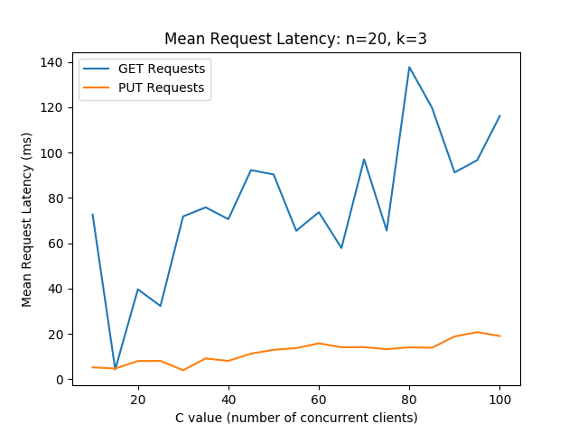

# Goal and Overview

The goal of this project was to explore distributed systems by implementing a simple distributed key-value store, along the
lines of Amazon's Dynamo. Of particular interest for this project were issues of availability and scalability of the system. 
With this in mind, we made several design trade-offs in order to ensure our system was highly available and scalable that 
we will explain in the following sections.

# Design and Implementation

## Our send_message and run_message_server implementations
For sending messages, we decided to use sockets to create some abstractions for sending and receiving messages. For
this, we have two functions:

1. run_message_server: This function accepts a port to listen for new messages on, a pointer to some state for the
   server, and some message handler function pointers. This function will bind on and listen to that port for incoming
   TCP connections. Each time a message comes in, it will parse out the type field to determine which handler should
   handle that particular message type. The handlers are passed in as a map of message types to message handlers. The
   message handlers may access and mutate data from the state variable that is passed in. This state variable is usually
   just an instance of GTStoreManager or GTStoreStorage. The message handlers produce as a return value another message
   to return to the client like a return value. Whenever an incoming message is accepted, its handler is run in a
   separate thread (the implications of this are explained in a later section).
2. send_message: This function accepts a message to send, and the address/port of the message server to send it to. It
   will deliver that message through a TCP connection, and then wait to receive a return message via that same
   connection.

## System Components
### GTStore Centralized Manager
Each GTStore cluster has a centralized manager. The manager is responsible for any bootstrapping involved in
a GTStore, whether on the client side or when new storage nodes spin up. The manager also keeps state
about the system such as a consistent hash ring of all the storage nodes and address/port information of all the storage nodes
and contacts storage nodes with updates to this state.

The state the manager keeps is the following:
* Replication factor - Replication factor of the system. Each storage node will be backed up by replication factor - 1 storage nodes, and
  will itself back up replication factor - 1 storage nodes.
* Hash ring - Data structure to represent the consistent hashing scheme of the system. The manager uses this to inform the storage 
  nodes of their neighbors.
* Node to port mapping - A mapping of the ports each storage node is listening on. It's assumed for this assignment that all of the
  storage nodes share an address (namely, localhost) but this could be easily generalized to an address as well as a port. The manager uses
  this when sending messages to storage nodes.

When a new GTStore storage node spins up, it contacts the manager node at a well-known port/address. The manager assigns that node and ID and 
adds it to its consistent hashing ring. It also records the port that the storage node will be listening on, which is sent in the initial message
by the storage node. The manager will then contact any existing nodes that will be affected by the new node joining with their updated state.
Finally, the manager will send a reply to the storage node with its assigned ID and other metadata 

The role of the manager is intentionally limited to bootstrapping duties.
### GTStore Storage Node

Our GTStoreStorage is implemented as a two-threaded process:

1) The first thread is a basic message server thread which handles incoming message requests. These requests include
   GET/PUT requests as well as metadata update requests and replica update requests. Note that this thread spawns some
   short lived threads for requests that come in. Each storage node must maintain the following metadata:

   * ID: The node's ID. For now we simply use the port number since this only needs to work on a single machine. This
     is assigned by the manager.
   * Hash: The hash of the ID. We simply use the C++ built in string hash.
   * Previous node: We use a consistent hashing ring for data partitioning. This is the node's previous immediate
     neighbor, backward on the ring.
   * Next node: The node's immediate neighbor forward on the ring.
   * Nodes Backed-up-by: If the replication factor is `k`, these are the `k-1` forward nodes on the ring. Our scheme
     for data replication is that a node is responsible for any keys that hash to values immediately before the node's
     hash on the ring, and the `k-1` nodes immediately forward on a ring back up a node's data.
   * Nodes Backing-up: The `k-1` nodes backward on the ring whose data a node is storing replicas of.
   * Cap: A special node, which is the first node backward on the ring which the node DOES NOT store replicas for. This
     node is used in the logic for determining if a node backs up a certain key or not.

   As an example, consider if the nodes are organized in this manner on the ring when `k = 3`:

   ```
   A -> B -> C
   ^         |
   |         |
   G         |
   ^         |
   |         v
   F <- E <- D
   ```

   Then the metadata that each node would manage would be:

   | Node | Next | Previous | Backing Up | Backed Up By | Cap |
   |:----:|:----:|:--------:|:----------:|:------------:|:---:|
   |  A   |  B   |    G     |    F, G    |     B, C     |  E  |
   |  B   |  C   |    A     |    G, A    |     C, D     |  F  |
   |  C   |  D   |    B     |    A, B    |     D, E     |  G  |
   |  D   |  E   |    C     |    B, C    |     E, F     |  A  |
   |  E   |  F   |    D     |    C, D    |     F, G     |  B  |
   |  F   |  G   |    E     |    D, E    |     G, A     |  C  |
   |  G   |  A   |    F     |    E, F    |     A, B     |  D  |

2) The second thread runs in the background and handles replicating data updates. See the sectio non data replication
   for more details.

When a node joins, it first contacts the centralized manager to receive an ID (in this case just its port number). The
manager then starts keeping track of the above metadata, and also makes sure to update the local metadata of the storage
nodes. It will only send these metadata updates to storage nodes affected by the join. When a node first joins, it
receives this metadata in the response.


### GTStore Client API Calls
explain the full process in bullet points how requests go through the system

1. init:
   * The client initializes its version of its key to 0. It also initializes the port of the manager and its ID.
   * The client contacts the manager to ask for a set of storage nodes the client can send request to.
   * The manager selects 4 or the number of nodes in the entire system, whichever is smaller, to send to the client. These are selected randomly.
   * The client initializes its set of known storage nodes with the nodes it receives from the manager.
2. get:
   * The client selects a random storage node from the set of storage nodes it is aware of.
   * The client sends a GET message with the key (and the version it wants; this version is explained in the data
     consistency section) it wants the value for to that storage node.
   * The storage node determines if it is responsible for storing that data element (makes use of the cap node for
     this). If it is (i.e it is the owner or a replica node for it), then it will confirm that it has it, and that it
     has the requested version or newer. If it does not have the latest version, then it will wait for a set amount of
     time, giving a chance for updated values to come in from othe replicas (see data consistency). If at that point it
     does not have the right version of the data item, it will return an error to the requester.
   * If the storage node is not responsible for that key, then it will determine which of its neighbors (prev or next)
     is closest to a node responsible for that key on the ring, and it will recursively send the request to that node and
     forward back its response.

3. put:
   * The client selects a random storage node from the set of storage nodes it is aware of.
   * The client sends a PUT message with the key, new value, and new version number of that key.
   * The storage node determines if it is responsible for this data element. If it is, it then checks that the received version
     number is older than a version it has, if it has this key. If it is, it will update the key/val pair it has.
   * The storage node will add this update to the queue for its asynchronous replication handler to handle (see data consistency).
   * The storage node will send a message to the client indicating the success of the PUT to the client.
   * If the storage node was not responsible for this key/value pair, it will determine which of its neighbors is closest to a node
     responsible for that key on the ring, and it will rescursively send the request to that node and forward its response to the client.
4. finalize: Our implementation of finalize on the client need not do anything since connections that are opened for
   sending messages get cleaned up automatically by send_message.

## Design Principles

### Data Partitioning
We chose to shard data across nodes to improve scalability. Sharding data allows us to avoid one node being in the critical path of all
requests, such as in a system with one hot node and every other node is a cold replica. This begs the question of how to decide which node is responsible for 
which keys. We implemented a consistent hashing scheme for this.

The idea of consistent hashing is very similar to a hashing function you might use for a hashmap, but we avoid the problem of having to change
the location of all keys when a node is added that we may run into with a more conventional hashing scheme. In a consistent hashing scheme, we imagine that all of the nodes live somewhere along a ring. Its location on the ring is determined by a hash function of the node. For a simple example, suppose we have nodes A, B, C, and D, and the hashes of these nodes are 1, 5, 10, and 15 respectively. The hash ring would look like this:

```
A ------> B
^         |
|         |
|         |
|         |
|         v
D ------> C

```

The arrows are in the direction of increasing hash, except in the case of the edge between D and A. In essence, the nodes are kept in a sorted, circular array.
The node that a key/value pair will live on is determined by this same hash function. In our implementation of consistent hashing, the responsible node for a key is the first node with a larger hash than the key's hash. In the above example, if we have a key that hashes to 3, it will live on node B, since that key will fall between node A's hash of 1 and node B's hash of 5. If we have a hash greater than 15, the largest node hash, it will circle around back to A.
Assuming we have a good hash function with relatively few collisions, we will get a pretty uniform distribution of keys across the nodes. The distribution will only improve as we add nodes, because the ranges of hashes that nodes are responsible for will decrease.

In our GTStore implementation, we used a very basic implementation of a consistent hashing scheme to determine which nodes were responsible for which keys. The result was a very uniform distribution of keys across the nodes such that no one node was responsible for a disproportionate number of keys.
### Data Replication

Recall the example in an earlier section if the nodes are organized in this manner on the ring when `k = 3`:

```
A -> B -> C
^         |
|         |
G         |
^         |
|         v
F <- E <- D
```

Then the metadata that each node would manage would be:

| Node | Next | Previous | Backing Up | Backed Up By | Cap |
|:----:|:----:|:--------:|:----------:|:------------:|:---:|
|  A   |  B   |    G     |    F, G    |     B, C     |  E  |
|  B   |  C   |    A     |    G, A    |     C, D     |  F  |
|  C   |  D   |    B     |    A, B    |     D, E     |  G  |
|  D   |  E   |    C     |    B, C    |     E, F     |  A  |
|  E   |  F   |    D     |    C, D    |     F, G     |  B  |
|  F   |  G   |    E     |    D, E    |     G, A     |  C  |
|  G   |  A   |    F     |    E, F    |     A, B     |  D  |

This means that any key which would hash to node A is also backed up on nodes B and C. This results in the data items
being duplicated on `3` nodes for `k = 3`.

Say a request comes in that would be hashed to node A. This means that B and C also store it. Say this request arrives
at one of these three nodes. That node will update the value in the local key/value store, and then add that update's
data to a queue for replication.

Upon adding to this queue, the additional storage thread for replication will wake up. It will then send update requests
to the other two relevant nodes to ensure that they have the latest copy.

The two extra nodes are determined using the CAP node and the Backing Up/Backed Up By sets, since the two extra nodes
will always be in the Backing Up/Backed up By Sets, and whether or not they are replicas for a given key can be
determined using the cap node. The cap node is useful for this since the cap node is the first node that a node does
not store replicas for. So, if the node and its cap node are put on a ring together, then all requests that the node
will store will hash to it, and everything else hashes to the cap node, so we can use it to check if a node is
responsible for a given key.

Doing the replication in this way takes the replication out of the critical path of servicing PUT requests, which makes
PUT requests faster.

Any of A, B, or C can service get requests for keys that would hash to A. If it doesn't have the key being requested, it
will wait a bounded amount of time for updates to come in.

### Data Consistency
Since data lives on multiple nodes and multiple nodes can service requests, we need to ensure that nodes have consistent data.
We chose to trade off strong consistency for high availability. If we were concerned with strong consistency, we could have designed our
system in such a way that replicas are unavailable until they have the latest copy of their data when a write occurs. We chose a weaker consistency model - we guarantee that our replica nodes will be updated within a bounded amount of time. This could raise an issue if an update gets serviced by one node and a subsequent get for that same key is serviced by a different node - it's not guaranteed that the update has been propagated to this node yet.

There are two elements to our approach to consistency. The first is a version number. Each client keeps a version number of its 
key. Whenever it updates the key, it increments its version number. When it makes a GET request, it asks for a specific version. In addition,
each storage node keeps track of the version of each key it has. When it gets a GET request, if it has the specified version or newer, it will serve that request with the value immediately. If the storage node doesn't have that version or doesn't have the key at all, it will simply sleep and retry a certain number of times, waiting to see if it gets any updates from other nodes (more on this in a bit). If, after a predetermined number of retries all fail, it is assumed that the key doesn't exist anywhere and an error is returned. Otherwise, if the node got an update during one of its retries, it will return the updated value.

The second element is the update thread in each storage node. This is how updates propagate among replica nodes. When a node services a PUT request, it will add the update to a queue that the replication thread consumes from. The replication thread asynchronously consumes updates from the queue and sends messages to relevant nodes to update their values and version numbers. We made this asynchronous in its own thread to ensure that PUT request latency is not reliant on ensuring all replica node are updated. In other words, we don't wait to ensure the update is propagated to all replica nodes to return a successful PUT result to the client. When a storage node receives a message from another node's replication thread (these messages are uniquely identified as being a replication update), it updates the key/value pair and version number it receives from the replication thread.  

These two components combine to ensure consistency on our system, under some constraints. We assumed that there would never be two clients updating identical keys concurrently - the provided API and test cases seemed to support this assumption. If that were the case, we could run into some write conflicts that we don't currently deal with - two clients concurrently updating to version 25 of the same key for example. We would need to add some logic either on the client side or on the storage node side for dealing with these conflicts. We also assume that if an update is pending, it will not be arbitrarily delayed. If this was the case, our timeout mechanism may result in us returning an error to the client when we shouldn't.

### Handling Temporary Failures

Our system currently does not handle node failures in any capacity; this will cause problems in the system. We make
an assumption that all storage nodes join the system prior to any clients connecting or requests coming in. In the
future however, we could add support for transferring keys on a node join in the following way:

1. A node joins
2. The node's next neighbor transfers its relevant keys and backups to it
3. The nodes's next neighbor sends messages to its backed-up-by set to indicate that those nodes can drop some keys that
   they no longer need to store replicas for.

Since we use consistent hashing, keys would only need to be transferred between those two nodes, and the only other
affected nodes would be those in the next neighbor's backed-up-by set, and they would just be able to delete data
items.

Node failures could be detected by having some error handling logic in send_message. If a node cannot be contacted, the
node who detected the failure could then inform the manager node, who will send metadata updates to affected nodes.
The failing node's next neighbor will then take over its set of keys (which it will already have due to our replication
scheme), and will only need to contact its backed-up-by set to update them with some extra keys they need to replicate.
This part can be done asynchronously through the replication thread.

## Client Driver Application

We have three rules for making the test_app in the Makefile. The first is make test_app, the second is unit_tests, and
the third is experiment_tests.

The unit_tests executable is what we used for testing during our development process. It
simply has several test scenarios that we can run and view the results of. Some of them will make use of the TEXT type
messages which we can send to nodes to get debugging/state information. We have tests for different numbers of node
joins, multiple clients synchronously sending GET/PUT requests, and multiple clients asynchronously sending GET/PUT
reqeusts. The `test_basic_put_get_client` test also shows the data consistency/replication working as we intended, since
it tends to have clients send requests to nodes which need to wait for updates from replicas.

When running the unit_tests executable, we get a sizeable trace which we use to make sure that our functionality is
working as intended. The experiment_tests rule simply compiles something that doesn't have this trace so that we can
extract the data from our experiments more easily.

The test_app rule is just a simple app that sends a GET and a PUT request for a specific key.

## Design Tradeoffs
When we implemented our system, we did so with availability and scalability in mind. We did this at the cost of strong consistency.
This will result in very fast PUTs but potentially very slow GETs. We will have fast PUTs because we don't wait for any gurantee of consistency
among any of the replicas before we consider the PUT request to be finished. The latency for PUTs should then be constant with respect to the replication factor, and will be linear with respect to the number of nodes in the system, since the PUT request has to reach a node that is responsible for the key
before it can be considered serviced, and so may need to traverse around the ring.

Conversely, our desire to ensure the correct version of a key's value is always returned results in potentially slow GET requests. If the servicing node detects it has an out of date version, it will sleep for an amount of time on the order of seconds, which can dramatically affect the average request time.

We decided that we were okay with these tradeoffs due to the potential use cases of the GTStore. If we're using a GTStore for a shopping cart application as described in the project description, this will be perfectly fine. In a shopping cart application, there are usually a lot of writes as a user adds items to his/her cart. Not until the very end, at checkout, will the user usually need to fetch the entire shopping cart. This lends itself to wanting fast PUTs and being okay with the occasional slow GET.

## Implementation Issues
Our implementation has a few issues:

* Occasionally, a storage node will fail to start up because it can't get a port because it's already in use. This is
  rare.
* Since we are not maintaining a finger table like the Chord DHT, and only send recursive requests to immediate
  neighbors, the worst case time complexity for servicing a request will be linear in the number of nodes.
* We originally developed run_message_server to work with only a single thread instead of spawning a thread for each
  message handler. We ran into two race conditions:
  
  1. Consider the below scenario where nodes G and H both get the get requests at the same time. G gets a request for
     something stored on Z, and H gets a request for something stored on A, so G and H send eachother recursive messages.
	 The way that send_message works, they will both be in a waiting state for their return messages, but unable to
	 process eachother's messages, resulting in a deadlock:

	 ```
	 A -> ... -> G -> H -> ... -> Z
	 ```

  2. A node gets a request for something that it should have (i.e it owns it or replicates it), but it does not have it.
     So it should wait for a bounded amount of time for an update from a replica/owner node. However, since the waiting
	 blocks the thread that receives messages, it will not receive the message in time, so it will always fail to get
	 the data item.

  The best solution to these problems would be to make send_message work asynchronously. Instead of waiting for the
  return message, it would basically run its own message server to get return messages asynchronously in one additional
  thread. Messages would then just need to have some data for their recipient and some request IDs. This would allow
  the number of threads for sending and servicing requests to be bounded. Additionally, eachs storage node could have
  one additional thread for processing update requests. Doing this however was going to require a large amount of
  refactoring, so we opted to mitigate the problem by just making the message server spawn one additional thread per
  request its servicing. This solution is not optimal because it does not bound the number of executing threads, and
  could still result in a deadlock in the first case if the server gets overwhelmed.
* We did not measure the amount of time that replication should take, so we just have the thread wait for up to 1 second
  for updates. If this were a production system we would want to run load tests to determine what the optimal wait time
  should be to give a high probability of the node getting the update in time to service the request. Additionally, this
  means that it's possible, though very unlikely, to get an error response on a GET request even if the data is in the
  system. This could be fixed with client retries, as it is an extrmely rare case.
* Each node has only one ID, and therefore only one point on the ring. This means that if there are few nodes, there
  may be a load imbalance.
* Our versioning system makes an assumption that the version IDs are correct and that two clients do not write to the
  same key with the same version ID and different values. While this assumption was safe to make for the constrained
  use case of this project, in a real system we would need to have a system for IDs based on some kind of logical
  lamport clock.

## Implementation and Task Division

Our process for developing this project included some individual work near the beginning. Jacob implemented the
functionality for the hash ring, while Jim implemented the functionality for send_message and run_message server. We
then worked collaboratively to brainstorm any protocols and metadata we needed, and pair programmed to implement most
of the other functionality.

# Evaluation

We added some additional tests for experimental evaluation. These tests spawn some number of storage nodes, and some
number of clients who make three sets of GET/PUT requests for a particular key in parallel with each other. Each
successive PUT request updates the key to a new value. We had a separate test for checking the correctness of tests
like these, but these ones will just measure the time it takes for the requests to go through, and print the data to
stdout for us to process.

Let k be the replication factor, n be the number of storage nodes in the system, and c be the number of clients making
requests to the system. We had three test cases:

1. The first varied k from 1 to 4 with n = 20 and c = 50.
2. The second varied n from 10 to 100 (by incrments of 5) with k = 3 and c = 50.
3. The third varied c from 10 to 100 (by incrments of 5) with k = 3 and n = 20.

Again, we used the test cases in test_app/unit_tests to test the correctness of our system.

# Results


## Proof of Data Partioning and Replication

Here are some copied lines from our trace of a test with 7 nodes and 10 clients with `k = 3`. This shows the state at
the end of the test of each node and the manager node:

```
=================================
Printing state for Manager Node
Hash Ring below
Node 60343 with hash 1764694317751521826 with port 60343
Node 37862 with hash 3577335306938523384 with port 37862
Node 11748 with hash 3988435895372687033 with port 11748
Node 20418 with hash 12335660351717175649 with port 20418
Node 39902 with hash 15425956691643007628 with port 39902
Node 43941 with hash 17644222025139527448 with port 43941
Node 5074 with hash 18440301586134564108 with port 5074
=================================
	sending message (5) to 127.0.0.1:20418
	(20418) accepted message... beginning parse
	(20418) waiting to accept next message
	(20418) accepted message of type 5
=================================
Printing state for Storage Node with id 20418
Previous Neighbor: Id 11748 Port 11748
Id: 20418 Port 20418
Next Neighbor: Id 39902 Port 39902
Nodes Backing Up below:
Node id 11748
Node id 37862
Nodes Backed Up By below:
Node id 39902
Node id 43941
Cap Node: 60343
Key Value Store:
	[jim harris's cart.v20]: [50 gallon drum,knives,latex mask,cleaning supplies,tarps,]
	[jacob meyer's cart.v19]: [50 gallon drum,knives,latex mask,cleaning supplies,tarps,]
	[ur mom's cart.v16]: [50 gallon drum,knives,latex mask,cleaning supplies,tarps,]
	[alfredo's cart.v17]: [50 gallon drum,knives,latex mask,cleaning supplies,tarps,]
	[bob's cart.v11]: [50 gallon drum,knives,latex mask,cleaning supplies,tarps,]
	[mary's cart.v13]: [50 gallon drum,knives,latex mask,cleaning supplies,tarps,]
=================================
	received return value for (5) from 127.0.0.1:20418
	sending message (5) to 127.0.0.1:60343
	(60343) accepted message... beginning parse
	(60343) waiting to accept next message
	(60343) accepted message of type 5
=================================
Printing state for Storage Node with id 60343
Previous Neighbor: Id 5074 Port 5074
Id: 60343 Port 60343
Next Neighbor: Id 37862 Port 37862
Nodes Backing Up below:
Node id 5074
Node id 43941
Nodes Backed Up By below:
Node id 37862
Node id 11748
Cap Node: 39902
Key Value Store:
	[pinata's cart.v18]: [50 gallon drum,knives,latex mask,cleaning supplies,tarps,]
	[sue's cart.v12]: [50 gallon drum,knives,latex mask,cleaning supplies,tarps,]
	[avagadro's cart.v15]: [50 gallon drum,knives,latex mask,cleaning supplies,tarps,]
=================================
	received return value for (5) from 127.0.0.1:60343
	sending message (5) to 127.0.0.1:39902
	(39902) accepted message... beginning parse
	(39902) waiting to accept next message
	(39902) accepted message of type 5
=================================
Printing state for Storage Node with id 39902
Previous Neighbor: Id 20418 Port 20418
Id: 39902 Port 39902
Next Neighbor: Id 43941 Port 43941
Nodes Backing Up below:
Node id 20418
Node id 11748
Nodes Backed Up By below:
Node id 43941
Node id 5074
Cap Node: 37862
Key Value Store:
	[jacob meyer's cart.v19]: [50 gallon drum,knives,latex mask,cleaning supplies,tarps,]
	[alfredo's cart.v17]: [50 gallon drum,knives,latex mask,cleaning supplies,tarps,]
	[ur mom's cart.v16]: [50 gallon drum,knives,latex mask,cleaning supplies,tarps,]
	[mary's cart.v13]: [50 gallon drum,knives,latex mask,cleaning supplies,tarps,]
	[tom's cart.v14]: [50 gallon drum,knives,latex mask,cleaning supplies,tarps,]
=================================
	received return value for (5) from 127.0.0.1:39902
	sending message (5) to 127.0.0.1:43941
	(43941) accepted message... beginning parse
	(43941) waiting to accept next message
	(43941) accepted message of type 5
=================================
Printing state for Storage Node with id 43941
Previous Neighbor: Id 39902 Port 39902
Id: 43941 Port 43941
Next Neighbor: Id 5074 Port 5074
Nodes Backing Up below:
Node id 39902
Node id 20418
Nodes Backed Up By below:
Node id 5074
Node id 60343
Cap Node: 11748
Key Value Store:
	[jacob meyer's cart.v19]: [50 gallon drum,knives,latex mask,cleaning supplies,tarps,]
	[alfredo's cart.v17]: [50 gallon drum,knives,latex mask,cleaning supplies,tarps,]
	[ur mom's cart.v16]: [50 gallon drum,knives,latex mask,cleaning supplies,tarps,]
	[mary's cart.v13]: [50 gallon drum,knives,latex mask,cleaning supplies,tarps,]
	[tom's cart.v14]: [50 gallon drum,knives,latex mask,cleaning supplies,tarps,]
=================================
	received return value for (5) from 127.0.0.1:43941
	sending message (5) to 127.0.0.1:37862
	(37862) accepted message... beginning parse
	(37862) waiting to accept next message
	(37862) accepted message of type 5
=================================
Printing state for Storage Node with id 37862
Previous Neighbor: Id 60343 Port 60343
Id: 37862 Port 37862
Next Neighbor: Id 11748 Port 11748
Nodes Backing Up below:
Node id 60343
Node id 5074
Nodes Backed Up By below:
Node id 11748
Node id 20418
Cap Node: 43941
Key Value Store:
	[pinata's cart.v18]: [50 gallon drum,knives,latex mask,cleaning supplies,tarps,]
	[avagadro's cart.v15]: [50 gallon drum,knives,latex mask,cleaning supplies,tarps,]
	[bob's cart.v11]: [50 gallon drum,knives,latex mask,cleaning supplies,tarps,]
	[jim harris's cart.v20]: [50 gallon drum,knives,latex mask,cleaning supplies,tarps,]
	[sue's cart.v12]: [50 gallon drum,knives,latex mask,cleaning supplies,tarps,]
=================================
	received return value for (5) from 127.0.0.1:37862
	(11748) accepted message... beginning parse
	sending message (5) to 127.0.0.1:11748
	(11748) waiting to accept next message
	(11748) accepted message of type 5
=================================
Printing state for Storage Node with id 11748
Previous Neighbor: Id 37862 Port 37862
Id: 11748 Port 11748
Next Neighbor: Id 20418 Port 20418
Nodes Backing Up below:
Node id 37862
Node id 60343
Nodes Backed Up By below:
Node id 20418
Node id 39902
Cap Node: 5074
Key Value Store:
	[pinata's cart.v18]: [50 gallon drum,knives,latex mask,cleaning supplies,tarps,]
	[avagadro's cart.v15]: [50 gallon drum,knives,latex mask,cleaning supplies,tarps,]
	[bob's cart.v11]: [50 gallon drum,knives,latex mask,cleaning supplies,tarps,]
	[jim harris's cart.v20]: [50 gallon drum,knives,latex mask,cleaning supplies,tarps,]
	[sue's cart.v12]: [50 gallon drum,knives,latex mask,cleaning supplies,tarps,]
=================================
	received return value for (5) from 127.0.0.1:11748
	sending message (5) to 127.0.0.1:5074
	(5074) accepted message... beginning parse
	(5074) waiting to accept next message
	(5074) accepted message of type 5
=================================
Printing state for Storage Node with id 5074
Previous Neighbor: Id 43941 Port 43941
Id: 5074 Port 5074
Next Neighbor: Id 60343 Port 60343
Nodes Backing Up below:
Node id 43941
Node id 39902
Nodes Backed Up By below:
Node id 60343
Node id 37862
Cap Node: 20418
Key Value Store:
	[tom's cart.v14]: [50 gallon drum,knives,latex mask,cleaning supplies,tarps,]
=================================

```

As you can see, at the end of the test, each of the data items has been successfully replicated to three nodes, and they
all have the proper updated value (in this test, we first wrote the value without cleaning supplies and tarps items,
and then send a second request to add these items to the cart).

## Proof of Data Consistency

Here are some copied lines from our trace:

```
replicator 37862: sending replica update to 20418 for bob's cart
    sending message (4) to 127.0.0.1:20418
    (20418) accepted message of type 1
20418,60343,20418,port 20418 bob's cart =================================================================================WHAT
    (20418) accepted message... beginning parse
    (20418) waiting to accept next message
    (20418) accepted message of type 4
Updating!
20418,60343,20418,Storage node: PUT/UPDATE I am a replica for bob's cart... checking if I have it
    received return value for (4) from 127.0.0.1:20418
replicator 37862: sent replica update to 20418
replicator 37862: done updating
Storage node 20418: I have bob's cart... here you go
    received return value for (1) from 127.0.0.1:20418
    received return value for (1) from 127.0.0.1:39902
    received return value for (1) from 127.0.0.1:43941
```

Here, we see that node 20418 got a request for "bob's cart", which it knew it was responsible for, but did not have. So,
it outputted "WHAT", and went to sleep for 1 second in hopes that it would receive an update.

Right above that line, we see the replicator thread from node 37862 begin to send an update message for "bob's cart" to
node 20418.

Right after node 20418 went to sleep, we can see it's message server accept a message of type 4, which is a data update
request.

Looking a little further down, we can see that his is a replica update for "bob's cart", since after that message is
processed, node 37862 acknowledges that its update has been processed.

We can then see that node 20418 then finds that it received an update and has "bob's cart", so it can fulfill the
request (which was recursive).


# Observations
The following pages are graphs showing the mean, median, and 90th percentile request latency
for both GET and PUT requests across our three experiments.





One immediate observation from these results is the performance of PUT requests. Across nearly all experiments, PUT requests
outperformed GET requests in mean and 90th percentile latency. As explained earlier, this is what we expected. 
Another interesting observation is that the median request latency is very similar for both requests. This shows that while the worst
case for GET is much worse due to our design desicions, on average they will perform roughly the same. We also notice that mean and median request
time seem to be increasing linearly as we increase storage nodes. This is due to our implementation of message passing between nodes - messages have to
traverse the ring of nodes to find the correct node. We chose this implementation due to its simplicity, but the trade off was performance. A potential mitigation would be to implement finger tables in the storage nodes or a similar data structure so that messages don't have to be passed between as many nodes.

We also believe our results show scalability of our system with respect to the number of clients. If we inspect the median request latency across different numbers of clients, the response times are blazing fast, with the slowest median response time still being under 20ms. Even with the linear-looking median request latency, we were still on the order of tens of milliseconds for both kinds of requests. Despite some limitations and trade-offs in our design, the result was a fairly performant system across multiple loads.


One of the tests that we ran involved 100 storage nodes servicing requests from 10 clients. This means a total of 10
keys should be stored in the system. Accounting for some errors in this test, we had 98 storage nodes in total. Note
that if the load was balanced perfectly for these keys, we should be utilizing 30 nodes since the replication factor was
3, meaning that each key would be on its own node. We found in this case that we were utilizing 24 nodes, which was
fairly close to being optimal, which shows that our load balancing worked reasonably well.

# Conclusion
We learned some useful lessons about the design of distributed systems from this project. We had read about consistent
hashing before, but did not fully understand how it works until we had to implement it ourselves here.

Additionally, by implementing our system as a ring, we realized the value that maintaining a finger table (as in the
Chord DHT) has in improving response time.

We also experienced the challenge of achieving data consistency in a distributed system. See the shortcomings section
for some of the issues we ran into with that.

Furthermore, by running into the two race condition scenarios mentioned in the design issues section, we learned that
that the proper way to implement our message server would have been to make it more asynchronous and stateless. Doing
so would allow for better resource management and scalability.